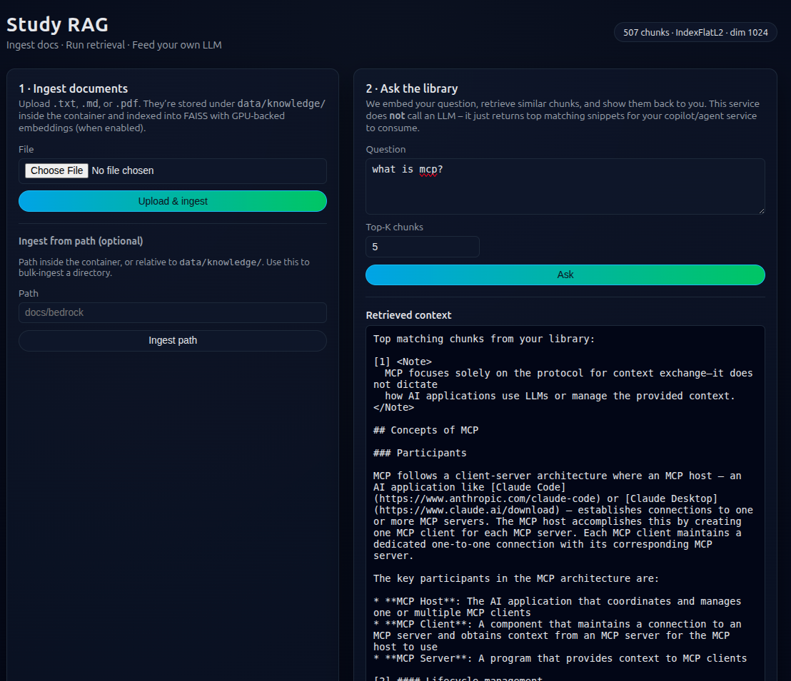

# Study RAG Service

A minimal, self-contained **retrieval-only** service:

* Ingest `.txt`, `.md`, and `.pdf` files.
* Embed them with **BAAI/bge-m3** (via `langchain-huggingface`).
* Store vectors in a persistent **FAISS** index.
* Expose:

  * a **JSON API** for your Copilot/Agent services
  * a **simple HTML UI** for manual upload and querying.

> This service **does not call an LLM**. It’s designed to be the **retrieval backend** that other projects (e.g. a Copilot/agent) call into.

---

## Features

* 🔹 Document ingestion from the browser (upload) or API.
* 🔹 Chunking via `RecursiveCharacterTextSplitter`:

  * `chunk_size = 1000`
  * `chunk_overlap = 200`
* 🔹 Embeddings with **BAAI/bge-m3** on GPU (if available) or CPU.
* 🔹 Persistent **FAISS** index on disk.
* 🔹 “Ask the library” UI: type a question, get back top-K matching snippets.
* 🔹 Simple JSON API for programmatic retrieval.

---

## Stack

* **Framework:** FastAPI
* **Embeddings:** `BAAI/bge-m3` via `langchain-huggingface`
* **Vector store:** FAISS (`IndexFlatL2`)
* **Chunking:** `RecursiveCharacterTextSplitter`
* **Templating/UI:** Jinja2 + custom dark-theme CSS
* **Container:** Docker + `docker compose`

---

## Directory Layout

```text
.
├── app/
│   ├── api.py             # FastAPI routes (UI + JSON API)
│   ├── ingest.py          # File loading + chunking
│   ├── vector_store.py    # FAISS index + persistence
│   ├── embeddings.py      # HuggingFace embeddings wrapper
│   ├── templates/         # Jinja2 templates (UI)
│   └── static/            # CSS, JS
├── data/
│   ├── knowledge/         # Raw uploaded documents
│   └── vector_store/      # FAISS index + metadata
├── requirements.txt
└── docker-compose.yml
```

---

## Running the Service

### Prereqs

* Docker
* Docker Compose
* (Optional) NVIDIA GPU + drivers for faster embedding; otherwise it runs on CPU.

### One command

From the project root:

```bash
docker compose up --build
```

Then open:

```text
http://localhost:8080
```

You should see the web UI.

---

## How to Use

### 1. Via the Web UI

1. Open `http://localhost:8080`.
2. Use **“1 · Upload documents”**:

   * Select one or more `.txt`, `.md`, or `.pdf` files.
   * Click **Upload**.
   * The service will:

     * Save files under `data/knowledge/`
     * Chunk them
     * Embed with `BAAI/bge-m3`
     * Append to the FAISS index on disk
3. Use **“2 · Ask the library”**:

   * Type a natural-language question.
   * The service embeds your question, performs a vector search, and returns **top-K chunks**.
   * The UI shows which document each chunk came from and the raw text.

This is exactly what a downstream Copilot/agent would receive as context before calling an LLM.

---

### 2. Via JSON API

> Adjust paths to match your actual routes (`app/api.py`). Example naming:

#### Health

```http
GET /healthz
```

Response:

```json
{ "status": "ok" }
```

#### Index status

```http
GET /status
```

Example response:

```json
{
  "index_type": "IndexFlatL2",
  "embedding_dimension": 1024,
  "doc_count": 427
}
```

#### Ingest (programmatic)

```http
POST /api/ingest
Content-Type: application/json

{
  "path": "/app/data/knowledge/some_doc.md"
}
```

> Or a multipart upload endpoint if you mirror the UI behavior.

#### Query (retrieval only)

```http
POST /api/query
Content-Type: application/json

{
  "question": "What is MCP?",
  "top_k": 5
}
```

Example response:

```json
{
  "question": "What is MCP?",
  "top_k": 5,
  "results": [
    {
      "doc_id": "model_context_protocol.md",
      "chunk_id": 9,
      "score": 0.12,
      "text": "<Note>\n  MCP focuses solely on the protocol for context exchange..."
    },
    {
      "doc_id": "model_context_protocol.md",
      "chunk_id": 0,
      "score": 0.19,
      "text": "Model Context Protocol (MCP) is an open protocol that..."
    }
  ]
}
```

---

## Internals (High Level)

On startup:

1. Try to load FAISS index from `data/vector_store/index.faiss`.
2. If not found:

   * Create a new FAISS `IndexFlatL2` with `dim=1024` (for `BAAI/bge-m3`).
3. Initialize a `HuggingFaceEmbeddings` instance for `BAAI/bge-m3`.

On ingest:

1. Save file(s) under `data/knowledge/`.
2. Load and split using `RecursiveCharacterTextSplitter`.
3. Embed chunks.
4. Add vectors + metadata to FAISS and persist back to `data/vector_store/`.

On query:

1. Embed the question with `BAAI/bge-m3`.
2. Run `index.search()` to get top-K neighbors.
3. Map indices back to stored text chunks + metadata.
4. Return them to the UI or JSON caller.

---


## Screenshots

1. **Home / status screen**


2. **Upload success**


3. **Ask the library result**


