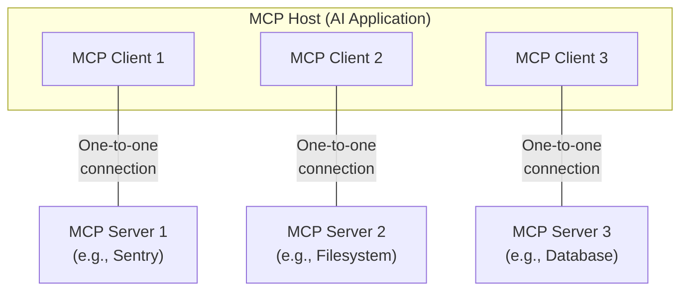
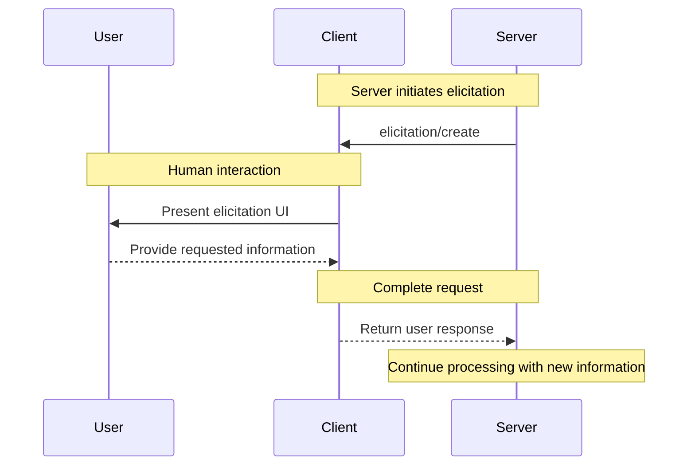
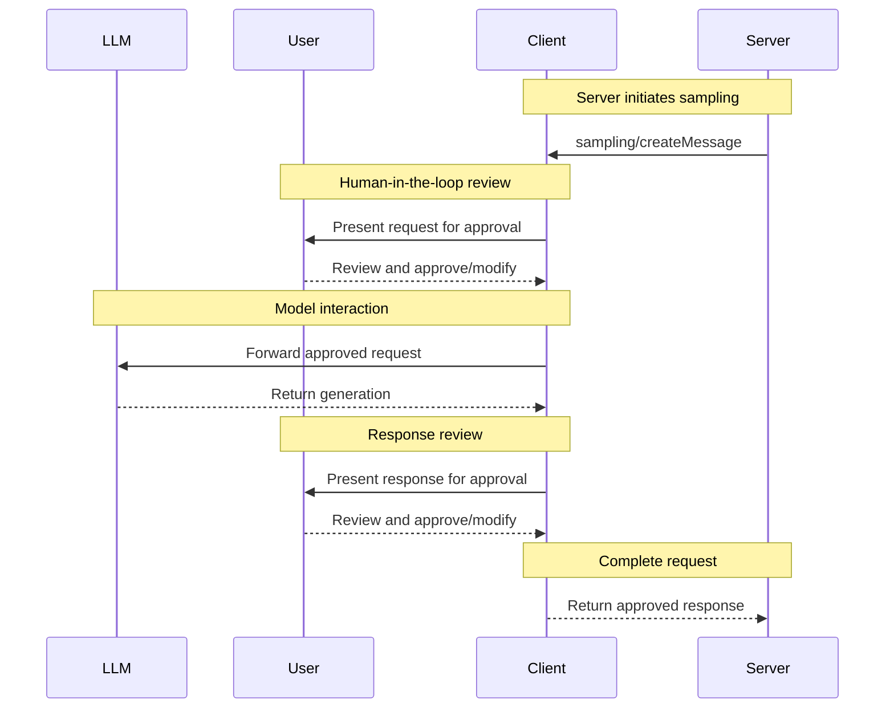

# Specification

<div id="enable-section-numbers" />

[Model Context Protocol](https://modelcontextprotocol.io) (MCP) is an open protocol that
enables seamless integration between LLM applications and external data sources and
tools. Whether you're building an AI-powered IDE, enhancing a chat interface, or creating
custom AI workflows, MCP provides a standardized way to connect LLMs with the context
they need.

This specification defines the authoritative protocol requirements, based on the
TypeScript schema in
[schema.ts](https://github.com/modelcontextprotocol/specification/blob/main/schema/2025-06-18/schema.ts).

For implementation guides and examples, visit
[modelcontextprotocol.io](https://modelcontextprotocol.io).

The key words "MUST", "MUST NOT", "REQUIRED", "SHALL", "SHALL NOT", "SHOULD", "SHOULD
NOT", "RECOMMENDED", "NOT RECOMMENDED", "MAY", and "OPTIONAL" in this document are to be
interpreted as described in [BCP 14](https://datatracker.ietf.org/doc/html/bcp14)
\[[RFC2119](https://datatracker.ietf.org/doc/html/rfc2119)]
\[[RFC8174](https://datatracker.ietf.org/doc/html/rfc8174)] when, and only when, they
appear in all capitals, as shown here.

## Overview

MCP provides a standardized way for applications to:

* Share contextual information with language models
* Expose tools and capabilities to AI systems
* Build composable integrations and workflows

The protocol uses [JSON-RPC](https://www.jsonrpc.org/) 2.0 messages to establish
communication between:

* **Hosts**: LLM applications that initiate connections
* **Clients**: Connectors within the host application
* **Servers**: Services that provide context and capabilities

MCP takes some inspiration from the
[Language Server Protocol](https://microsoft.github.io/language-server-protocol/), which
standardizes how to add support for programming languages across a whole ecosystem of
development tools. In a similar way, MCP standardizes how to integrate additional context
and tools into the ecosystem of AI applications.

## Key Details

### Base Protocol

* [JSON-RPC](https://www.jsonrpc.org/) message format
* Stateful connections
* Server and client capability negotiation

### Features

Servers offer any of the following features to clients:

* **Resources**: Context and data, for the user or the AI model to use
* **Prompts**: Templated messages and workflows for users
* **Tools**: Functions for the AI model to execute

Clients may offer the following features to servers:

* **Sampling**: Server-initiated agentic behaviors and recursive LLM interactions
* **Roots**: Server-initiated inquiries into uri or filesystem boundaries to operate in
* **Elicitation**: Server-initiated requests for additional information from users

### Additional Utilities

* Configuration
* Progress tracking
* Cancellation
* Error reporting
* Logging

## Security and Trust & Safety

The Model Context Protocol enables powerful capabilities through arbitrary data access
and code execution paths. With this power comes important security and trust
considerations that all implementors must carefully address.

### Key Principles

1. **User Consent and Control**
   * Users must explicitly consent to and understand all data access and operations
   * Users must retain control over what data is shared and what actions are taken
   * Implementors should provide clear UIs for reviewing and authorizing activities

2. **Data Privacy**
   * Hosts must obtain explicit user consent before exposing user data to servers
   * Hosts must not transmit resource data elsewhere without user consent
   * User data should be protected with appropriate access controls

3. **Tool Safety**
   * Tools represent arbitrary code execution and must be treated with appropriate
     caution.
     * In particular, descriptions of tool behavior such as annotations should be
       considered untrusted, unless obtained from a trusted server.
   * Hosts must obtain explicit user consent before invoking any tool
   * Users should understand what each tool does before authorizing its use

4. **LLM Sampling Controls**
   * Users must explicitly approve any LLM sampling requests
   * Users should control:
     * Whether sampling occurs at all
     * The actual prompt that will be sent
     * What results the server can see
   * The protocol intentionally limits server visibility into prompts

### Implementation Guidelines

While MCP itself cannot enforce these security principles at the protocol level,
implementors **SHOULD**:

1. Build robust consent and authorization flows into their applications
2. Provide clear documentation of security implications
3. Implement appropriate access controls and data protections
4. Follow security best practices in their integrations
5. Consider privacy implications in their feature designs

## Learn More

Explore the detailed specification for each protocol component:

<CardGroup cols={5}>
  <Card title="Architecture" icon="sitemap" href="/specification/2025-06-18/architecture" />

  <Card title="Base Protocol" icon="code" href="/specification/2025-06-18/basic" />

  <Card title="Server Features" icon="server" href="/specification/2025-06-18/server" />

  <Card title="Client Features" icon="user" href="/specification/2025-06-18/client" />

  <Card title="Contributing" icon="pencil" href="/community/communication" />
</CardGroup>


---

> To find navigation and other pages in this documentation, fetch the llms.txt file at: https://modelcontextprotocol.io/llms.txt


# Architecture overview

This overview of the Model Context Protocol (MCP) discusses its [scope](#scope) and [core concepts](#concepts-of-mcp), and provides an [example](#example) demonstrating each core concept.

Because MCP SDKs abstract away many concerns, most developers will likely find the [data layer protocol](#data-layer-protocol) section to be the most useful. It discusses how MCP servers can provide context to an AI application.

For specific implementation details, please refer to the documentation for your [language-specific SDK](/docs/sdk).

## Scope

The Model Context Protocol includes the following projects:

* [MCP Specification](https://modelcontextprotocol.io/specification/latest): A specification of MCP that outlines the implementation requirements for clients and servers.
* [MCP SDKs](/docs/sdk): SDKs for different programming languages that implement MCP.
* **MCP Development Tools**: Tools for developing MCP servers and clients, including the [MCP Inspector](https://github.com/modelcontextprotocol/inspector)
* [MCP Reference Server Implementations](https://github.com/modelcontextprotocol/servers): Reference implementations of MCP servers.

<Note>
  MCP focuses solely on the protocol for context exchange—it does not dictate
  how AI applications use LLMs or manage the provided context.
</Note>

## Concepts of MCP

### Participants

MCP follows a client-server architecture where an MCP host — an AI application like [Claude Code](https://www.anthropic.com/claude-code) or [Claude Desktop](https://www.claude.ai/download) — establishes connections to one or more MCP servers. The MCP host accomplishes this by creating one MCP client for each MCP server. Each MCP client maintains a dedicated one-to-one connection with its corresponding MCP server.

The key participants in the MCP architecture are:

* **MCP Host**: The AI application that coordinates and manages one or multiple MCP clients
* **MCP Client**: A component that maintains a connection to an MCP server and obtains context from an MCP server for the MCP host to use
* **MCP Server**: A program that provides context to MCP clients

**For example**: Visual Studio Code acts as an MCP host. When Visual Studio Code establishes a connection to an MCP server, such as the [Sentry MCP server](https://docs.sentry.io/product/sentry-mcp/), the Visual Studio Code runtime instantiates an MCP client object that maintains the connection to the Sentry MCP server.
When Visual Studio Code subsequently connects to another MCP server, such as the [local filesystem server](https://github.com/modelcontextprotocol/servers/tree/main/src/filesystem), the Visual Studio Code runtime instantiates an additional MCP client object to maintain this connection, hence maintaining a one-to-one
relationship of MCP clients to MCP servers.



Note that **MCP server** refers to the program that serves context data, regardless of
where it runs. MCP servers can execute locally or remotely. For example, when
Claude Desktop launches the [filesystem
server](https://github.com/modelcontextprotocol/servers/tree/main/src/filesystem),
the server runs locally on the same machine because it uses the STDIO
transport. This is commonly referred to as a "local" MCP server. The official
[Sentry MCP server](https://docs.sentry.io/product/sentry-mcp/) runs on the
Sentry platform, and uses the Streamable HTTP transport. This is commonly
referred to as a "remote" MCP server.

### Layers

MCP consists of two layers:

* **Data layer**: Defines the JSON-RPC based protocol for client-server communication, including lifecycle management, and core primitives, such as tools, resources, prompts and notifications.
* **Transport layer**: Defines the communication mechanisms and channels that enable data exchange between clients and servers, including transport-specific connection establishment, message framing, and authorization.

Conceptually the data layer is the inner layer, while the transport layer is the outer layer.

#### Data layer

The data layer implements a [JSON-RPC 2.0](https://www.jsonrpc.org/) based exchange protocol that defines the message structure and semantics.
This layer includes:

* **Lifecycle management**: Handles connection initialization, capability negotiation, and connection termination between clients and servers
* **Server features**: Enables servers to provide core functionality including tools for AI actions, resources for context data, and prompts for interaction templates from and to the client
* **Client features**: Enables servers to ask the client to sample from the host LLM, elicit input from the user, and log messages to the client
* **Utility features**: Supports additional capabilities like notifications for real-time updates and progress tracking for long-running operations

#### Transport layer

The transport layer manages communication channels and authentication between clients and servers. It handles connection establishment, message framing, and secure communication between MCP participants.

MCP supports two transport mechanisms:

* **Stdio transport**: Uses standard input/output streams for direct process communication between local processes on the same machine, providing optimal performance with no network overhead.
* **Streamable HTTP transport**: Uses HTTP POST for client-to-server messages with optional Server-Sent Events for streaming capabilities. This transport enables remote server communication and supports standard HTTP authentication methods including bearer tokens, API keys, and custom headers. MCP recommends using OAuth to obtain authentication tokens.

The transport layer abstracts communication details from the protocol layer, enabling the same JSON-RPC 2.0 message format across all transport mechanisms.

### Data Layer Protocol

A core part of MCP is defining the schema and semantics between MCP clients and MCP servers. Developers will likely find the data layer — in particular, the set of [primitives](#primitives) — to be the most interesting part of MCP. It is the part of MCP that defines the ways developers can share context from MCP servers to MCP clients.

MCP uses [JSON-RPC 2.0](https://www.jsonrpc.org/) as its underlying RPC protocol. Client and servers send requests to each other and respond accordingly. Notifications can be used when no response is required.

#### Lifecycle management

MCP is a <Tooltip tip="A subset of MCP can be made stateless using the Streamable HTTP transport">stateful protocol</Tooltip> that requires lifecycle management. The purpose of lifecycle management is to negotiate the <Tooltip tip="Features and operations that a client or server supports, such as tools, resources, or prompts">capabilities</Tooltip> that both client and server support. Detailed information can be found in the [specification](/specification/latest/basic/lifecycle), and the [example](#example) showcases the initialization sequence.

#### Primitives

MCP primitives are the most important concept within MCP. They define what clients and servers can offer each other. These primitives specify the types of contextual information that can be shared with AI applications and the range of actions that can be performed.

MCP defines three core primitives that *servers* can expose:

* **Tools**: Executable functions that AI applications can invoke to perform actions (e.g., file operations, API calls, database queries)
* **Resources**: Data sources that provide contextual information to AI applications (e.g., file contents, database records, API responses)
* **Prompts**: Reusable templates that help structure interactions with language models (e.g., system prompts, few-shot examples)

Each primitive type has associated methods for discovery (`*/list`), retrieval (`*/get`), and in some cases, execution (`tools/call`).
MCP clients will use the `*/list` methods to discover available primitives. For example, a client can first list all available tools (`tools/list`) and then execute them. This design allows listings to be dynamic.

As a concrete example, consider an MCP server that provides context about a database. It can expose tools for querying the database, a resource that contains the schema of the database, and a prompt that includes few-shot examples for interacting with the tools.

For more details about server primitives see [server concepts](./server-concepts).

MCP also defines primitives that *clients* can expose. These primitives allow MCP server authors to build richer interactions.

* **Sampling**: Allows servers to request language model completions from the client's AI application. This is useful when servers' authors want access to a language model, but want to stay model independent and not include a language model SDK in their MCP server. They can use the `sampling/complete` method to request a language model completion from the client's AI application.
* **Elicitation**: Allows servers to request additional information from users. This is useful when servers' authors want to get more information from the user, or ask for confirmation of an action. They can use the `elicitation/request` method to request additional information from the user.
* **Logging**: Enables servers to send log messages to clients for debugging and monitoring purposes.

For more details about client primitives see [client concepts](./client-concepts).

Besides server and client primitives, the protocol offers cross-cutting utility primitives that augment how requests are executed:

* **Tasks (Experimental)**: Durable execution wrappers that enable deferred result retrieval and status tracking for MCP requests (e.g., expensive computations, workflow automation, batch processing, multi-step operations)

#### Notifications

The protocol supports real-time notifications to enable dynamic updates between servers and clients. For example, when a server's available tools change—such as when new functionality becomes available or existing tools are modified—the server can send tool update notifications to inform connected clients about these changes. Notifications are sent as JSON-RPC 2.0 notification messages (without expecting a response) and enable MCP servers to provide real-time updates to connected clients.

## Example

### Data Layer

This section provides a step-by-step walkthrough of an MCP client-server interaction, focusing on the data layer protocol. We'll demonstrate the lifecycle sequence, tool operations, and notifications using JSON-RPC 2.0 messages.

<Steps>
  <Step title="Initialization (Lifecycle Management)">
    MCP begins with lifecycle management through a capability negotiation handshake. As described in the [lifecycle management](#lifecycle-management) section, the client sends an `initialize` request to establish the connection and negotiate supported features.

    <CodeGroup>
      ```json Initialize Request theme={null}
      {
        "jsonrpc": "2.0",
        "id": 1,
        "method": "initialize",
        "params": {
          "protocolVersion": "2025-06-18",
          "capabilities": {
            "elicitation": {}
          },
          "clientInfo": {
            "name": "example-client",
            "version": "1.0.0"
          }
        }
      }
      ```

      ```json Initialize Response theme={null}
      {
        "jsonrpc": "2.0",
        "id": 1,
        "result": {
          "protocolVersion": "2025-06-18",
          "capabilities": {
            "tools": {
              "listChanged": true
            },
            "resources": {}
          },
          "serverInfo": {
            "name": "example-server",
            "version": "1.0.0"
          }
        }
      }
      ```
    </CodeGroup>

    #### Understanding the Initialization Exchange

    The initialization process is a key part of MCP's lifecycle management and serves several critical purposes:

    1. **Protocol Version Negotiation**: The `protocolVersion` field (e.g., "2025-06-18") ensures both client and server are using compatible protocol versions. This prevents communication errors that could occur when different versions attempt to interact. If a mutually compatible version is not negotiated, the connection should be terminated.

    2. **Capability Discovery**: The `capabilities` object allows each party to declare what features they support, including which [primitives](#primitives) they can handle (tools, resources, prompts) and whether they support features like [notifications](#notifications). This enables efficient communication by avoiding unsupported operations.

    3. **Identity Exchange**: The `clientInfo` and `serverInfo` objects provide identification and versioning information for debugging and compatibility purposes.

    In this example, the capability negotiation demonstrates how MCP primitives are declared:

    **Client Capabilities**:

    * `"elicitation": {}` - The client declares it can work with user interaction requests (can receive `elicitation/create` method calls)

    **Server Capabilities**:

    * `"tools": {"listChanged": true}` - The server supports the tools primitive AND can send `tools/list_changed` notifications when its tool list changes
    * `"resources": {}` - The server also supports the resources primitive (can handle `resources/list` and `resources/read` methods)

    After successful initialization, the client sends a notification to indicate it's ready:

    ```json Notification theme={null}
    {
      "jsonrpc": "2.0",
      "method": "notifications/initialized"
    }
    ```

    #### How This Works in AI Applications

    During initialization, the AI application's MCP client manager establishes connections to configured servers and stores their capabilities for later use. The application uses this information to determine which servers can provide specific types of functionality (tools, resources, prompts) and whether they support real-time updates.

    ```python Pseudo-code for AI application initialization theme={null}
    # Pseudo Code
    async with stdio_client(server_config) as (read, write):
        async with ClientSession(read, write) as session:
            init_response = await session.initialize()
            if init_response.capabilities.tools:
                app.register_mcp_server(session, supports_tools=True)
            app.set_server_ready(session)
    ```
  </Step>

  <Step title="Tool Discovery (Primitives)">
    Now that the connection is established, the client can discover available tools by sending a `tools/list` request. This request is fundamental to MCP's tool discovery mechanism — it allows clients to understand what tools are available on the server before attempting to use them.

    <CodeGroup>
      ```json Tools List Request theme={null}
      {
        "jsonrpc": "2.0",
        "id": 2,
        "method": "tools/list"
      }
      ```

      ```json Tools List Response theme={null}
      {
        "jsonrpc": "2.0",
        "id": 2,
        "result": {
          "tools": [
            {
              "name": "calculator_arithmetic",
              "title": "Calculator",
              "description": "Perform mathematical calculations including basic arithmetic, trigonometric functions, and algebraic operations",
              "inputSchema": {
                "type": "object",
                "properties": {
                  "expression": {
                    "type": "string",
                    "description": "Mathematical expression to evaluate (e.g., '2 + 3 * 4', 'sin(30)', 'sqrt(16)')"
                  }
                },
                "required": ["expression"]
              }
            },
            {
              "name": "weather_current",
              "title": "Weather Information",
              "description": "Get current weather information for any location worldwide",
              "inputSchema": {
                "type": "object",
                "properties": {
                  "location": {
                    "type": "string",
                    "description": "City name, address, or coordinates (latitude,longitude)"
                  },
                  "units": {
                    "type": "string",
                    "enum": ["metric", "imperial", "kelvin"],
                    "description": "Temperature units to use in response",
                    "default": "metric"
                  }
                },
                "required": ["location"]
              }
            }
          ]
        }
      }
      ```
    </CodeGroup>

    #### Understanding the Tool Discovery Request

    The `tools/list` request is simple, containing no parameters.

    #### Understanding the Tool Discovery Response

    The response contains a `tools` array that provides comprehensive metadata about each available tool. This array-based structure allows servers to expose multiple tools simultaneously while maintaining clear boundaries between different functionalities.

    Each tool object in the response includes several key fields:

    * **`name`**: A unique identifier for the tool within the server's namespace. This serves as the primary key for tool execution and should follow a clear naming pattern (e.g., `calculator_arithmetic` rather than just `calculate`)
    * **`title`**: A human-readable display name for the tool that clients can show to users
    * **`description`**: Detailed explanation of what the tool does and when to use it
    * **`inputSchema`**: A JSON Schema that defines the expected input parameters, enabling type validation and providing clear documentation about required and optional parameters

    #### How This Works in AI Applications

    The AI application fetches available tools from all connected MCP servers and combines them into a unified tool registry that the language model can access. This allows the LLM to understand what actions it can perform and automatically generates the appropriate tool calls during conversations.

    ```python Pseudo-code for AI application tool discovery theme={null}
    # Pseudo-code using MCP Python SDK patterns
    available_tools = []
    for session in app.mcp_server_sessions():
        tools_response = await session.list_tools()
        available_tools.extend(tools_response.tools)
    conversation.register_available_tools(available_tools)
    ```
  </Step>

  <Step title="Tool Execution (Primitives)">
    The client can now execute a tool using the `tools/call` method. This demonstrates how MCP primitives are used in practice: after discovering available tools, the client can invoke them with appropriate arguments.

    #### Understanding the Tool Execution Request

    The `tools/call` request follows a structured format that ensures type safety and clear communication between client and server. Note that we're using the proper tool name from the discovery response (`weather_current`) rather than a simplified name:

    <CodeGroup>
      ```json Tool Call Request theme={null}
      {
        "jsonrpc": "2.0",
        "id": 3,
        "method": "tools/call",
        "params": {
          "name": "weather_current",
          "arguments": {
            "location": "San Francisco",
            "units": "imperial"
          }
        }
      }
      ```

      ```json Tool Call Response theme={null}
      {
        "jsonrpc": "2.0",
        "id": 3,
        "result": {
          "content": [
            {
              "type": "text",
              "text": "Current weather in San Francisco: 68°F, partly cloudy with light winds from the west at 8 mph. Humidity: 65%"
            }
          ]
        }
      }
      ```
    </CodeGroup>

    #### Key Elements of Tool Execution

    The request structure includes several important components:

    1. **`name`**: Must match exactly the tool name from the discovery response (`weather_current`). This ensures the server can correctly identify which tool to execute.

    2. **`arguments`**: Contains the input parameters as defined by the tool's `inputSchema`. In this example:
       * `location`: "San Francisco" (required parameter)
       * `units`: "imperial" (optional parameter, defaults to "metric" if not specified)

    3. **JSON-RPC Structure**: Uses standard JSON-RPC 2.0 format with unique `id` for request-response correlation.

    #### Understanding the Tool Execution Response

    The response demonstrates MCP's flexible content system:

    1. **`content` Array**: Tool responses return an array of content objects, allowing for rich, multi-format responses (text, images, resources, etc.)

    2. **Content Types**: Each content object has a `type` field. In this example, `"type": "text"` indicates plain text content, but MCP supports various content types for different use cases.

    3. **Structured Output**: The response provides actionable information that the AI application can use as context for language model interactions.

    This execution pattern allows AI applications to dynamically invoke server functionality and receive structured responses that can be integrated into conversations with language models.

    #### How This Works in AI Applications

    When the language model decides to use a tool during a conversation, the AI application intercepts the tool call, routes it to the appropriate MCP server, executes it, and returns the results back to the LLM as part of the conversation flow. This enables the LLM to access real-time data and perform actions in the external world.

    ```python  theme={null}
    # Pseudo-code for AI application tool execution
    async def handle_tool_call(conversation, tool_name, arguments):
        session = app.find_mcp_session_for_tool(tool_name)
        result = await session.call_tool(tool_name, arguments)
        conversation.add_tool_result(result.content)
    ```
  </Step>

  <Step title="Real-time Updates (Notifications)">
    MCP supports real-time notifications that enable servers to inform clients about changes without being explicitly requested. This demonstrates the notification system, a key feature that keeps MCP connections synchronized and responsive.

    #### Understanding Tool List Change Notifications

    When the server's available tools change—such as when new functionality becomes available, existing tools are modified, or tools become temporarily unavailable—the server can proactively notify connected clients:

    ```json Request theme={null}
    {
      "jsonrpc": "2.0",
      "method": "notifications/tools/list_changed"
    }
    ```

    #### Key Features of MCP Notifications

    1. **No Response Required**: Notice there's no `id` field in the notification. This follows JSON-RPC 2.0 notification semantics where no response is expected or sent.

    2. **Capability-Based**: This notification is only sent by servers that declared `"listChanged": true` in their tools capability during initialization (as shown in Step 1).

    3. **Event-Driven**: The server decides when to send notifications based on internal state changes, making MCP connections dynamic and responsive.

    #### Client Response to Notifications

    Upon receiving this notification, the client typically reacts by requesting the updated tool list. This creates a refresh cycle that keeps the client's understanding of available tools current:

    ```json Request theme={null}
    {
      "jsonrpc": "2.0",
      "id": 4,
      "method": "tools/list"
    }
    ```

    #### Why Notifications Matter

    This notification system is crucial for several reasons:

    1. **Dynamic Environments**: Tools may come and go based on server state, external dependencies, or user permissions
    2. **Efficiency**: Clients don't need to poll for changes; they're notified when updates occur
    3. **Consistency**: Ensures clients always have accurate information about available server capabilities
    4. **Real-time Collaboration**: Enables responsive AI applications that can adapt to changing contexts

    This notification pattern extends beyond tools to other MCP primitives, enabling comprehensive real-time synchronization between clients and servers.

    #### How This Works in AI Applications

    When the AI application receives a notification about changed tools, it immediately refreshes its tool registry and updates the LLM's available capabilities. This ensures that ongoing conversations always have access to the most current set of tools, and the LLM can dynamically adapt to new functionality as it becomes available.

    ```python  theme={null}
    # Pseudo-code for AI application notification handling
    async def handle_tools_changed_notification(session):
        tools_response = await session.list_tools()
        app.update_available_tools(session, tools_response.tools)
        if app.conversation.is_active():
            app.conversation.notify_llm_of_new_capabilities()
    ```
  </Step>
</Steps>


---

> To find navigation and other pages in this documentation, fetch the llms.txt file at: https://modelcontextprotocol.io/llms.txt


# Understanding MCP servers

MCP servers are programs that expose specific capabilities to AI applications through standardized protocol interfaces.

Common examples include file system servers for document access, database servers for data queries, GitHub servers for code management, Slack servers for team communication, and calendar servers for scheduling.

## Core Server Features

Servers provide functionality through three building blocks:

| Feature       | Explanation                                                                                                                                                                             | Examples                                                           | Who controls it |
| ------------- | --------------------------------------------------------------------------------------------------------------------------------------------------------------------------------------- | ------------------------------------------------------------------ | --------------- |
| **Tools**     | Functions that your LLM can actively call, and decides when to use them based on user requests. Tools can write to databases, call external APIs, modify files, or trigger other logic. | Search flights<br />Send messages<br />Create calendar events      | Model           |
| **Resources** | Passive data sources that provide read-only access to information for context, such as file contents, database schemas, or API documentation.                                           | Retrieve documents<br />Access knowledge bases<br />Read calendars | Application     |
| **Prompts**   | Pre-built instruction templates that tell the model to work with specific tools and resources.                                                                                          | Plan a vacation<br />Summarize my meetings<br />Draft an email     | User            |

We will use a hypothetical scenario to demonstrate the role of each of these features, and show how they can work together.

### Tools

Tools enable AI models to perform actions. Each tool defines a specific operation with typed inputs and outputs. The model requests tool execution based on context.

#### How Tools Work

Tools are schema-defined interfaces that LLMs can invoke. MCP uses JSON Schema for validation. Each tool performs a single operation with clearly defined inputs and outputs. Tools may require user consent prior to execution, helping to ensure users maintain control over actions taken by a model.

**Protocol operations:**

| Method       | Purpose                  | Returns                                |
| ------------ | ------------------------ | -------------------------------------- |
| `tools/list` | Discover available tools | Array of tool definitions with schemas |
| `tools/call` | Execute a specific tool  | Tool execution result                  |

**Example tool definition:**

```typescript  theme={null}
{
  name: "searchFlights",
  description: "Search for available flights",
  inputSchema: {
    type: "object",
    properties: {
      origin: { type: "string", description: "Departure city" },
      destination: { type: "string", description: "Arrival city" },
      date: { type: "string", format: "date", description: "Travel date" }
    },
    required: ["origin", "destination", "date"]
  }
}
```

#### Example: Travel Booking

Tools enable AI applications to perform actions on behalf of users. In a travel planning scenario, the AI application might use several tools to help book a vacation:

**Flight Search**

```
searchFlights(origin: "NYC", destination: "Barcelona", date: "2024-06-15")
```

Queries multiple airlines and returns structured flight options.

**Calendar Blocking**

```
createCalendarEvent(title: "Barcelona Trip", startDate: "2024-06-15", endDate: "2024-06-22")
```

Marks the travel dates in the user's calendar.

**Email notification**

```
sendEmail(to: "team@work.com", subject: "Out of Office", body: "...")
```

Sends an automated out-of-office message to colleagues.

#### User Interaction Model

Tools are model-controlled, meaning AI models can discover and invoke them automatically. However, MCP emphasizes human oversight through several mechanisms.

For trust and safety, applications can implement user control through various mechanisms, such as:

* Displaying available tools in the UI, enabling users to define whether a tool should be made available in specific interactions
* Approval dialogs for individual tool executions
* Permission settings for pre-approving certain safe operations
* Activity logs that show all tool executions with their results

### Resources

Resources provide structured access to information that the AI application can retrieve and provide to models as context.

#### How Resources Work

Resources expose data from files, APIs, databases, or any other source that an AI needs to understand context. Applications can access this information directly and decide how to use it - whether that's selecting relevant portions, searching with embeddings, or passing it all to the model.

Each resource has a unique URI (e.g., `file:///path/to/document.md`) and declares its MIME type for appropriate content handling.

Resources support two discovery patterns:

* **Direct Resources** - fixed URIs that point to specific data. Example: `calendar://events/2024` - returns calendar availability for 2024
* **Resource Templates** - dynamic URIs with parameters for flexible queries. Example:
  * `travel://activities/{city}/{category}` - returns activities by city and category
  * `travel://activities/barcelona/museums` - returns all museums in Barcelona

Resource Templates include metadata such as title, description, and expected MIME type, making them discoverable and self-documenting.

**Protocol operations:**

| Method                     | Purpose                         | Returns                                |
| -------------------------- | ------------------------------- | -------------------------------------- |
| `resources/list`           | List available direct resources | Array of resource descriptors          |
| `resources/templates/list` | Discover resource templates     | Array of resource template definitions |
| `resources/read`           | Retrieve resource contents      | Resource data with metadata            |
| `resources/subscribe`      | Monitor resource changes        | Subscription confirmation              |

#### Example: Getting Travel Planning Context

Continuing with the travel planning example, resources provide the AI application with access to relevant information:

* **Calendar data** (`calendar://events/2024`) - Checks user availability
* **Travel documents** (`file:///Documents/Travel/passport.pdf`) - Accesses important documents
* **Previous itineraries** (`trips://history/barcelona-2023`) - References past trips and preferences

The AI application retrieves these resources and decides how to process them, whether selecting a subset of data using embeddings or keyword search, or passing raw data directly to the model.

In this case, it provides calendar data, weather information, and travel preferences to the model, enabling it to check availability, look up weather patterns, and reference past travel preferences.

**Resource Template Examples:**

```json  theme={null}
{
  "uriTemplate": "weather://forecast/{city}/{date}",
  "name": "weather-forecast",
  "title": "Weather Forecast",
  "description": "Get weather forecast for any city and date",
  "mimeType": "application/json"
}

{
  "uriTemplate": "travel://flights/{origin}/{destination}",
  "name": "flight-search",
  "title": "Flight Search",
  "description": "Search available flights between cities",
  "mimeType": "application/json"
}
```

These templates enable flexible queries. For weather data, users can access forecasts for any city/date combination. For flights, they can search routes between any two airports. When a user has input "NYC" as the `origin` airport and begins to input "Bar" as the `destination` airport, the system can suggest "Barcelona (BCN)" or "Barbados (BGI)".

#### Parameter Completion

Dynamic resources support parameter completion. For example:

* Typing "Par" as input for `weather://forecast/{city}` might suggest "Paris" or "Park City"
* Typing "JFK" for `flights://search/{airport}` might suggest "JFK - John F. Kennedy International"

The system helps discover valid values without requiring exact format knowledge.

#### User Interaction Model

Resources are application-driven, giving them flexibility in how they retrieve, process, and present available context. Common interaction patterns include:

* Tree or list views for browsing resources in familiar folder-like structures
* Search and filter interfaces for finding specific resources
* Automatic context inclusion or smart suggestions based on heuristics or AI selection
* Manual or bulk selection interfaces for including single or multiple resources

Applications are free to implement resource discovery through any interface pattern that suits their needs. The protocol doesn't mandate specific UI patterns, allowing for resource pickers with preview capabilities, smart suggestions based on current conversation context, bulk selection for including multiple resources, or integration with existing file browsers and data explorers.

### Prompts

Prompts provide reusable templates. They allow MCP server authors to provide parameterized prompts for a domain, or showcase how to best use the MCP server.

#### How Prompts Work

Prompts are structured templates that define expected inputs and interaction patterns. They are user-controlled, requiring explicit invocation rather than automatic triggering. Prompts can be context-aware, referencing available resources and tools to create comprehensive workflows. Similar to resources, prompts support parameter completion to help users discover valid argument values.

**Protocol operations:**

| Method         | Purpose                    | Returns                               |
| -------------- | -------------------------- | ------------------------------------- |
| `prompts/list` | Discover available prompts | Array of prompt descriptors           |
| `prompts/get`  | Retrieve prompt details    | Full prompt definition with arguments |

#### Example: Streamlined Workflows

Prompts provide structured templates for common tasks. In the travel planning context:

**"Plan a vacation" prompt:**

```json  theme={null}
{
  "name": "plan-vacation",
  "title": "Plan a vacation",
  "description": "Guide through vacation planning process",
  "arguments": [
    { "name": "destination", "type": "string", "required": true },
    { "name": "duration", "type": "number", "description": "days" },
    { "name": "budget", "type": "number", "required": false },
    { "name": "interests", "type": "array", "items": { "type": "string" } }
  ]
}
```

Rather than unstructured natural language input, the prompt system enables:

1. Selection of the "Plan a vacation" template
2. Structured input: Barcelona, 7 days, \$3000, \["beaches", "architecture", "food"]
3. Consistent workflow execution based on the template

#### User Interaction Model

Prompts are user-controlled, requiring explicit invocation. The protocol gives implementers freedom to design interfaces that feel natural within their application. Key principles include:

* Easy discovery of available prompts
* Clear descriptions of what each prompt does
* Natural argument input with validation
* Transparent display of the prompt's underlying template

Applications typically expose prompts through various UI patterns such as:

* Slash commands (typing "/" to see available prompts like /plan-vacation)
* Command palettes for searchable access
* Dedicated UI buttons for frequently used prompts
* Context menus that suggest relevant prompts

## Bringing Servers Together

The real power of MCP emerges when multiple servers work together, combining their specialized capabilities through a unified interface.

### Example: Multi-Server Travel Planning

Consider a personalized AI travel planner application, with three connected servers:

* **Travel Server** - Handles flights, hotels, and itineraries
* **Weather Server** - Provides climate data and forecasts
* **Calendar/Email Server** - Manages schedules and communications

#### The Complete Flow

1. **User invokes a prompt with parameters:**

   ```json  theme={null}
   {
     "prompt": "plan-vacation",
     "arguments": {
       "destination": "Barcelona",
       "departure_date": "2024-06-15",
       "return_date": "2024-06-22",
       "budget": 3000,
       "travelers": 2
     }
   }
   ```

2. **User selects resources to include:**
   * `calendar://my-calendar/June-2024` (from Calendar Server)
   * `travel://preferences/europe` (from Travel Server)
   * `travel://past-trips/Spain-2023` (from Travel Server)

3. **AI processes the request using tools:**

   The AI first reads all selected resources to gather context - identifying available dates from the calendar, learning preferred airlines and hotel types from travel preferences, and discovering previously enjoyed locations from past trips.

   Using this context, the AI then executes a series of Tools:

   * `searchFlights()` - Queries airlines for NYC to Barcelona flights
   * `checkWeather()` - Retrieves climate forecasts for travel dates

   The AI then uses this information to create the booking and following steps, requesting approval from the user where necessary:

   * `bookHotel()` - Finds hotels within the specified budget
   * `createCalendarEvent()` - Adds the trip to the user's calendar
   * `sendEmail()` - Sends confirmation with trip details

**The result:** Through multiple MCP servers, the user researched and booked a Barcelona trip tailored to their schedule. The "Plan a Vacation" prompt guided the AI to combine Resources (calendar availability and travel history) with Tools (searching flights, booking hotels, updating calendars) across different servers—gathering context and executing the booking. A task that could've taken hours was completed in minutes using MCP.


---

> To find navigation and other pages in this documentation, fetch the llms.txt file at: https://modelcontextprotocol.io/llms.txt


# Understanding MCP clients

MCP clients are instantiated by host applications to communicate with particular MCP servers. The host application, like Claude.ai or an IDE, manages the overall user experience and coordinates multiple clients. Each client handles one direct communication with one server.

Understanding the distinction is important: the *host* is the application users interact with, while *clients* are the protocol-level components that enable server connections.

## Core Client Features

In addition to making use of context provided by servers, clients may provide several features to servers. These client features allow server authors to build richer interactions.

| Feature         | Explanation                                                                                                                                                                                       | Example                                                                                                                                |
| --------------- | ------------------------------------------------------------------------------------------------------------------------------------------------------------------------------------------------- | -------------------------------------------------------------------------------------------------------------------------------------- |
| **Elicitation** | Elicitation enables servers to request specific information from users during interactions, providing a structured way for servers to gather information on demand.                               | A server booking travel may ask for the user's preferences on airplane seats, room type or their contact number to finalise a booking. |
| **Roots**       | Roots allow clients to specify which directories servers should focus on, communicating intended scope through a coordination mechanism.                                                          | A server for booking travel may be given access to a specific directory, from which it can read a user's calendar.                     |
| **Sampling**    | Sampling allows servers to request LLM completions through the client, enabling an agentic workflow. This approach puts the client in complete control of user permissions and security measures. | A server for booking travel may send a list of flights to an LLM and request that the LLM pick the best flight for the user.           |

### Elicitation

Elicitation enables servers to request specific information from users during interactions, creating more dynamic and responsive workflows.

#### Overview

Elicitation provides a structured way for servers to gather necessary information on demand. Instead of requiring all information up front or failing when data is missing, servers can pause their operations to request specific inputs from users. This creates more flexible interactions where servers adapt to user needs rather than following rigid patterns.

**Elicitation flow:**



The flow enables dynamic information gathering. Servers can request specific data when needed, users provide information through appropriate UI, and servers continue processing with the newly acquired context.

**Elicitation components example:**

```typescript  theme={null}
{
  method: "elicitation/requestInput",
  params: {
    message: "Please confirm your Barcelona vacation booking details:",
    schema: {
      type: "object",
      properties: {
        confirmBooking: {
          type: "boolean",
          description: "Confirm the booking (Flights + Hotel = $3,000)"
        },
        seatPreference: {
          type: "string",
          enum: ["window", "aisle", "no preference"],
          description: "Preferred seat type for flights"
        },
        roomType: {
          type: "string",
          enum: ["sea view", "city view", "garden view"],
          description: "Preferred room type at hotel"
        },
        travelInsurance: {
          type: "boolean",
          default: false,
          description: "Add travel insurance ($150)"
        }
      },
      required: ["confirmBooking"]
    }
  }
}
```

#### Example: Holiday Booking Approval

A travel booking server demonstrates elicitation's power through the final booking confirmation process. When a user has selected their ideal vacation package to Barcelona, the server needs to gather final approval and any missing details before proceeding.

The server elicits booking confirmation with a structured request that includes the trip summary (Barcelona flights June 15-22, beachfront hotel, total \$3,000) and fields for any additional preferences—such as seat selection, room type, or travel insurance options.

As the booking progresses, the server elicits contact information needed to complete the reservation. It might ask for traveler details for flight bookings, special requests for the hotel, or emergency contact information.

#### User Interaction Model

Elicitation interactions are designed to be clear, contextual, and respectful of user autonomy:

**Request presentation**: Clients display elicitation requests with clear context about which server is asking, why the information is needed, and how it will be used. The request message explains the purpose while the schema provides structure and validation.

**Response options**: Users can provide the requested information through appropriate UI controls (text fields, dropdowns, checkboxes), decline to provide information with optional explanation, or cancel the entire operation. Clients validate responses against the provided schema before returning them to servers.

**Privacy considerations**: Elicitation never requests passwords or API keys. Clients warn about suspicious requests and let users review data before sending.

### Roots

Roots define filesystem boundaries for server operations, allowing clients to specify which directories servers should focus on.

#### Overview

Roots are a mechanism for clients to communicate filesystem access boundaries to servers. They consist of file URIs that indicate directories where servers can operate, helping servers understand the scope of available files and folders. While roots communicate intended boundaries, they do not enforce security restrictions. Actual security must be enforced at the operating system level, via file permissions and/or sandboxing.

**Root structure:**

```json  theme={null}
{
  "uri": "file:///Users/agent/travel-planning",
  "name": "Travel Planning Workspace"
}
```

Roots are exclusively filesystem paths and always use the `file://` URI scheme. They help servers understand project boundaries, workspace organization, and accessible directories. The roots list can be updated dynamically as users work with different projects or folders, with servers receiving notifications through `roots/list_changed` when boundaries change.

#### Example: Travel Planning Workspace

A travel agent working with multiple client trips benefits from roots to organize filesystem access. Consider a workspace with different directories for various aspects of travel planning.

The client provides filesystem roots to the travel planning server:

* `file:///Users/agent/travel-planning` - Main workspace containing all travel files
* `file:///Users/agent/travel-templates` - Reusable itinerary templates and resources
* `file:///Users/agent/client-documents` - Client passports and travel documents

When the agent creates a Barcelona itinerary, well-behaved servers respect these boundaries—accessing templates, saving the new itinerary, and referencing client documents within the specified roots. Servers typically access files within roots by using relative paths from the root directories or by utilizing file search tools that respect the root boundaries.

If the agent opens an archive folder like `file:///Users/agent/archive/2023-trips`, the client updates the roots list via `roots/list_changed`.

For a complete implementation of a server that respects roots, see the [filesystem server](https://github.com/modelcontextprotocol/servers/tree/main/src/filesystem) in the official servers repository.

#### Design Philosophy

Roots serve as a coordination mechanism between clients and servers, not a security boundary. The specification requires that servers "SHOULD respect root boundaries," and not that they "MUST enforce" them, because servers run code the client cannot control.

Roots work best when servers are trusted or vetted, users understand their advisory nature, and the goal is preventing accidents rather than stopping malicious behavior. They excel at context scoping (telling servers where to focus), accident prevention (helping well-behaved servers stay in bounds), and workflow organization (such as managing project boundaries automatically).

#### User Interaction Model

Roots are typically managed automatically by host applications based on user actions, though some applications may expose manual root management:

**Automatic root detection**: When users open folders, clients automatically expose them as roots. Opening a travel workspace allows the client to expose that directory as a root, helping servers understand which itineraries and documents are in scope for the current work.

**Manual root configuration**: Advanced users can specify roots through configuration. For example, adding `/travel-templates` for reusable resources while excluding directories with financial records.

### Sampling

Sampling allows servers to request language model completions through the client, enabling agentic behaviors while maintaining security and user control.

#### Overview

Sampling enables servers to perform AI-dependent tasks without directly integrating with or paying for AI models. Instead, servers can request that the client—which already has AI model access—handle these tasks on their behalf. This approach puts the client in complete control of user permissions and security measures. Because sampling requests occur within the context of other operations—like a tool analyzing data—and are processed as separate model calls, they maintain clear boundaries between different contexts, allowing for more efficient use of the context window.

**Sampling flow:**



The flow ensures security through multiple human-in-the-loop checkpoints. Users review and can modify both the initial request and the generated response before it returns to the server.

**Request parameters example:**

```typescript  theme={null}
{
  messages: [
    {
      role: "user",
      content: "Analyze these flight options and recommend the best choice:\n" +
               "[47 flights with prices, times, airlines, and layovers]\n" +
               "User preferences: morning departure, max 1 layover"
    }
  ],
  modelPreferences: {
    hints: [{
      name: "claude-sonnet-4-20250514"  // Suggested model
    }],
    costPriority: 0.3,      // Less concerned about API cost
    speedPriority: 0.2,     // Can wait for thorough analysis
    intelligencePriority: 0.9  // Need complex trade-off evaluation
  },
  systemPrompt: "You are a travel expert helping users find the best flights based on their preferences",
  maxTokens: 1500
}
```

#### Example: Flight Analysis Tool

Consider a travel booking server with a tool called `findBestFlight` that uses sampling to analyze available flights and recommend the optimal choice. When a user asks "Book me the best flight to Barcelona next month," the tool needs AI assistance to evaluate complex trade-offs.

The tool queries airline APIs and gathers 47 flight options. It then requests AI assistance to analyze these options: "Analyze these flight options and recommend the best choice: \[47 flights with prices, times, airlines, and layovers] User preferences: morning departure, max 1 layover."

The client initiates the sampling request, allowing the AI to evaluate trade-offs—like cheaper red-eye flights versus convenient morning departures. The tool uses this analysis to present the top three recommendations.

#### User Interaction Model

While not a requirement, sampling is designed to allow human-in-the-loop control. Users can maintain oversight through several mechanisms:

**Approval controls**: Sampling requests may require explicit user consent. Clients can show what the server wants to analyze and why. Users can approve, deny, or modify requests.

**Transparency features**: Clients can display the exact prompt, model selection, and token limits, allowing users to review AI responses before they return to the server.

**Configuration options**: Users can set model preferences, configure auto-approval for trusted operations, or require approval for everything. Clients may provide options to redact sensitive information.

**Security considerations**: Both clients and servers must handle sensitive data appropriately during sampling. Clients should implement rate limiting and validate all message content. The human-in-the-loop design ensures that server-initiated AI interactions cannot compromise security or access sensitive data without explicit user consent.


---

> To find navigation and other pages in this documentation, fetch the llms.txt file at: https://modelcontextprotocol.io/llms.txt


# Versioning

The Model Context Protocol uses string-based version identifiers following the format
`YYYY-MM-DD`, to indicate the last date backwards incompatible changes were made.

<Info>
  The protocol version will *not* be incremented when the
  protocol is updated, as long as the changes maintain backwards compatibility. This allows
  for incremental improvements while preserving interoperability.
</Info>

## Revisions

Revisions may be marked as:

* **Draft**: in-progress specifications, not yet ready for consumption.
* **Current**: the current protocol version, which is ready for use and may continue to
  receive backwards compatible changes.
* **Final**: past, complete specifications that will not be changed.

The **current** protocol version is [**2025-11-25**](/specification/2025-11-25/).

## Negotiation

Version negotiation happens during
[initialization](/specification/latest/basic/lifecycle#initialization). Clients and
servers **MAY** support multiple protocol versions simultaneously, but they **MUST**
agree on a single version to use for the session.

The protocol provides appropriate error handling if version negotiation fails, allowing
clients to gracefully terminate connections when they cannot find a version compatible
with the server.


---

> To find navigation and other pages in this documentation, fetch the llms.txt file at: https://modelcontextprotocol.io/llms.txt


